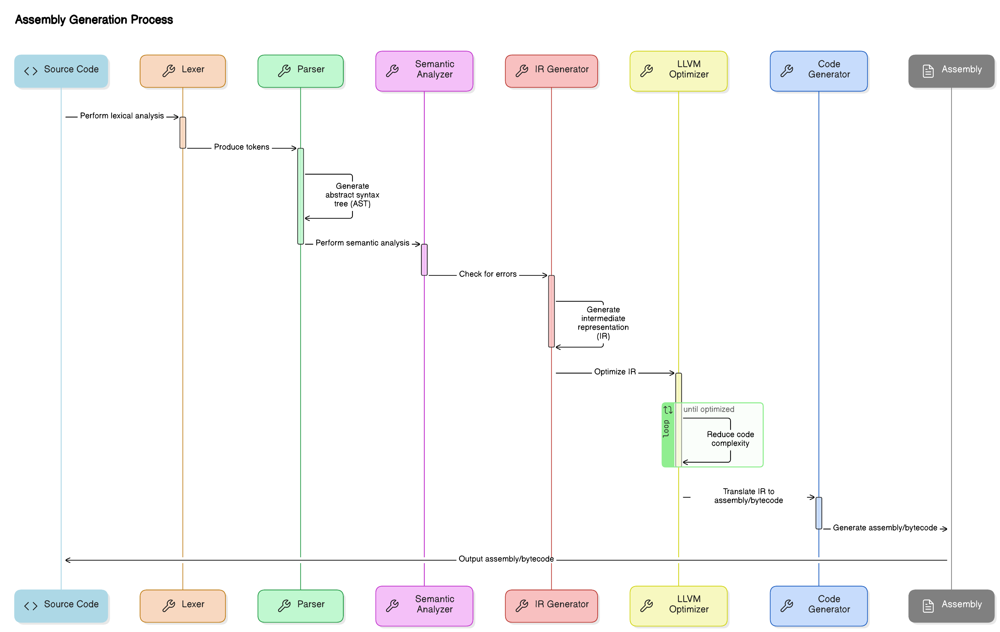

# Obfuscation analysis

# Table of contents
- [Introduction](#introduction)
  - [LLVM: A Compiler Infrastructure Overview](#llvm-a-compiler-infrastructure-overview)
    - [OLLVM: Turning Intermediate Representation Into Atrocities](#ollvm-turning-intermediate-representation-into-atrocities)

- [Obfuscation: The Art of Mathematical Deception](#obfuscation-the-art-of-mathematical-deception)
  - [Obfuscating Data](#obfuscating-data)
    - [Data: All Null Literals](#data-all-null-literals)

## Introduction
As part of my work-study program as a reverse engineer, I'm in charge of analyzing the various layers of obfuscation in compiled code through the interfaces of the Tigress and OLLVM compilers.
The final rendering is a GUI overlay for three types of decompiler (IDA Pro, Ghidra and Binary Ninja) to enable real-time code clean-up with a native C plugin or an external Python script (which I'll have to justify with a benchmark).

Starting from the beginning, software obfuscation is a method to make programs more difficult to reverse engineer. There are multiple reasons why this is done such as protecting intellectual property, defense in depth or hiding bugs. 
No matter the reason, there are multiple ways to go about in making the software more difficult to understand, from fully manual modifications to advanced commercial obfuscation frameworks.

Before trying to de-obfuscate anything and everything, you need to understand how obfuscation works, its different application and abstraction layers, and above all how it works on LLVM and Tigress.

## LLVM: A Compiler Infrastructure Overview
LLVM is a compiler infrastructure. To understand what it is exactly we need to dive into compilation  
process (this is most accurate for unmanaged code like C/C++).

We can distinguish three steps of assembly generation from the source code:

1. Front end, which includes:
    * lexer, which performs lexical analysis of the raw code and produces tokens (strings with certain meaning)
    * parser, which produces an abstract syntax tree (tokens grouped in a tree which represents the actual algorithm implemented in the source code)
    * semantic analysis (mainly type checking), during which the AST is checked for errors like wrong use of types or use of variables before initialization
    * generation of intermediate representation (IR), usually based on AST
2. Middle-end, which aims at reducing code complexity for example by precalculating stuff. It must not change the algorithm/program itself.
3. Back end, which translates the IR to expected output (assembly or bytecode).

The core of LLVM is the optimizer but the project also includes a compiler front end - clang - which is intended to be used with the LLVM toolchain.

  

### OLLVM: Turning Intermediate Representation Into Atrocities
Now let's talk about obfuscation ! Now that we know how LLVM works, we can quickly get some ideas about the various possible layers of obfuscation.
Technically, obfuscation can be performed at any abstraction level of a program. In the case of LLVM, the most common is on bytecode (the IR level).

> [!NOTE]
> 'But why obfuscate the LLVM bytecode? Why not the source code? Or the binary?', you may ask.

Regarding the engineering aspects, it is because there are lots of front-ends converting different languages into the same LLVM bytecode (Clang/Clang++ for C/C++, Mono LLVM for C#, Python and so on). 
Hence, by working at the bytecode level, it is possible to obfuscate programs written in many languages without even knowing them. Another good thing is that the obfuscation can be easily integrated with the existing compilation chains: just add a few obfuscation flags.

# Obfuscation: The Art of Mathematical Deception
A common practice in obfuscation is to use mathematics... after all, that's what computing is all about. 
So we're going to look at different mathematical expressions for obfuscation.

## Obfuscating Data
Present data obfuscation techniques focus on common data types, such as integers, strings, and arrays. 
We can transform data via splitting, merging, procedurization, encoding, etc.

### Data: All Null Literals
The process of obfuscating all null literals in a code is really simple. It means that we are going to replace almost all the zeroes in the code by a non-trivial boolean expression, proved to be always false.

$$
\
    \left(p_1 \ast\left(\left(x \lor a_1 \right)^{2} \right) \neq p_2 \ast\left(\left(y \lor a_2 \right)^{2} \right)\right)
\
$$

With:
- (p1) and (p2) be _distinct_ prime numbers.
- (a1) and (a2) be _distinct_ strictly positive random numbers.
- (x) and (y) be two variables picked from the program (they have to be reachable from the obfuscation instructions).

The expression will always return a boolean zero (false). The idea is to insert this test into our code, just before the 0 we want to obfuscate and to replace this 0 by the result of our comparison.
As you probably noticed  we will have to play attention to the type of the original 0 and make sure we cast the result of our expression to it's type.

This type of obfuscation may not be the most sophisticated ever written but it's enough to learn the basics of LLVM bytecode obfuscation and maybe to annoy people in reverse engineering for a few minutes... until they use a nicely crafted [miasm](https://code.google.com/archive/p/miasm/) script!